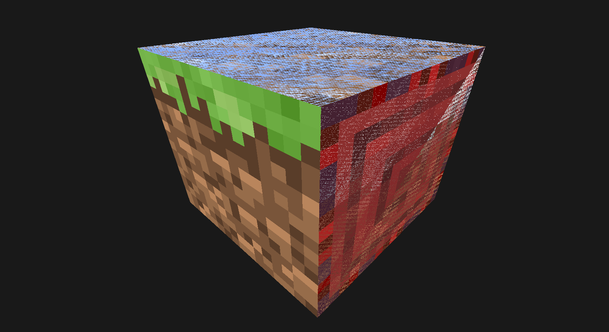
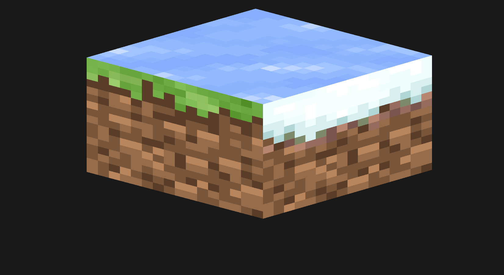
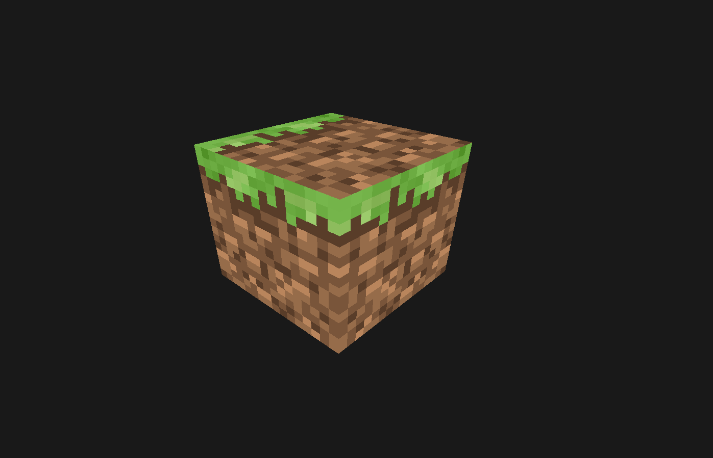

# GameDevForum

### Dependencies:
* premake5.lua

### Get started:
* git clone https://github.com/QuestionAnswer2313/GameDevForum
* cd GameDevForum/Scripts/Linux/SandboxApp/
* ./rebuild_debug.sh

### Build:
* ./build_debug.sh

### Проблема с GameDevForum
OpenGL: проблема при рендеринге текстурированного куба с использованием перспективной камеры, при этом с орфографической камерой все работает нормально

Добрый вечер!

Пытаюсь отрендерить текстурированный куб, используя перспективную камеру получается следующее:


Когда переключаюсь на орфографическую камеру, то результат корректный:


Также результат становится корректным, когда использую только одну текстуру:


Не понимаю, где именно ошибка, буду благодарен за любую помощь в решении данной проблемы.

Вот код проекта, билд работает пока что только под линукс: Проект на гитхабе

Для рендеринга использую VBO(24 вершины), EBO(36 индексов), VAO(vec3, vec2, float)

Текстуры привязываю так:

```c
// внутренности texture_list_bind
i32 i;
for (i = 0; i < list->NextTextureIndex; ++i)
{
    glBindTextureUnit(i, list->Textures[i]);
}
```

Флаги:
```c
glEnable(GL_DEPTH_TEST);
glEnable(GL_BLEND);
glBlendFunc(GL_SRC_ALPHA, GL_ONE_MINUS_SRC_ALPHA);
```

Шейдер:
```c
#vertex shader
#version 450 core
layout(location = 0) in vec3 i_Position;
layout(location = 1) in vec2 i_TextureCoordinates;
layout(location = 2) in float i_TextureID;

uniform mat4 u_ViewProjection;

out vec4 o_Color;
out vec2 o_TextureCoordinates;
out float o_TextureID;

void main()
{
    gl_Position = u_ViewProjection * vec4(i_Position, 1.0);
    o_TextureCoordinates = i_TextureCoordinates;
    o_TextureID = i_TextureID;
}

#fragment shader
#version 450 core
layout(location = 0) out vec4 Color;
layout(binding = 0) uniform sampler2D u_Textures[32];

in vec2 o_TextureCoordinates;
in float o_TextureID;

void main()
{
    int textId = int(o_TextureID);
    Color = vec4(texture(u_Textures[textId], o_TextureCoordinates).rgb, 1.0);
}
```

Если смотреть Mesh Viewer в RenderDoc, то все данные передаются правильно:
VTX  IDX  i_Position.x  i_Position.y  i_Position.z  i_TextureCoordinates.x  i_TextureCoordinates.y  i_TextureID
0  0  -0.50    0.50    0.50    0.00    1.00    0.00
1  1    0.50    0.50    0.50    1.00    1.00    0.00
2  3  -0.50  -0.50    0.50    0.00    0.00    0.00
3  3  -0.50  -0.50    0.50    0.00    0.00    0.00
4  1    0.50    0.50    0.50    1.00    1.00    0.00
5  2    0.50  -0.50    0.50    1.00    0.00    0.00
6  4  -0.50    0.50  -0.50    0.00    1.00    1.00
7  7  -0.50  -0.50  -0.50    0.00    0.00    1.00
8  5    0.50    0.50  -0.50    1.00    1.00    1.00
9  5    0.50    0.50  -0.50    1.00    1.00    1.00
10  7  -0.50  -0.50  -0.50    0.00    0.00    1.00
11  6    0.50  -0.50  -0.50    1.00    0.00    1.00
12  8  -0.50    0.50    0.50    0.00    1.00    2.00
13  11  -0.50  -0.50    0.50    0.00    0.00    2.00
14  9  -0.50    0.50  -0.50    1.00    1.00    2.00
15  9  -0.50    0.50  -0.50    1.00    1.00    2.00
16  11  -0.50  -0.50    0.50    0.00    0.00    2.00
17  10  -0.50  -0.50  -0.50    1.00    0.00    2.00
18  12    0.50    0.50    0.50    0.00    1.00    3.00
19  13    0.50    0.50  -0.50    1.00    1.00    3.00
20  15    0.50  -0.50    0.50    0.00    0.00    3.00
21  15    0.50  -0.50    0.50    0.00    0.00    3.00
22  13    0.50    0.50  -0.50    1.00    1.00    3.00
23  14    0.50  -0.50  -0.50    1.00    0.00    3.00
24  16  -0.50  -0.50  -0.50    0.00    1.00    4.00
25  19  -0.50  -0.50    0.50    0.00    0.00    4.00
26  17    0.50  -0.50  -0.50    1.00    1.00    4.00
27  17    0.50  -0.50  -0.50    1.00    1.00    4.00
28  19  -0.50  -0.50    0.50    0.00    0.00    4.00
29  18    0.50  -0.50    0.50    1.00    0.00    4.00
30  20  -0.50    0.50  -0.50    0.00    1.00    5.00
31  21    0.50    0.50  -0.50    1.00    1.00    5.00
32  23  -0.50    0.50    0.50    0.00    0.00    5.00
33  23  -0.50    0.50    0.50    0.00    0.00    5.00
34  21    0.50    0.50  -0.50    1.00    1.00    5.00
35  22    0.50    0.50    0.50    1.00    0.00    5.00

Индексы рассчитываются следующим образом:
```c
for (i = 0, temp = 0; i < count; i += 36, temp += 24)
{
  // Front - CW
  in[i]     = 0 + temp;
  in[i + 1] = 1 + temp;
  in[i + 2] = 3 + temp;
  in[i + 3] = 3 + temp;
  in[i + 4] = 1 + temp;
  in[i + 5] = 2 + temp;

  // Back - CCW
  in[i + 6]  = 4 + temp;
  in[i + 7]  = 7 + temp;
  in[i + 8]  = 5 + temp;
  in[i + 9]  = 5 + temp;
  in[i + 10] = 7 + temp;
  in[i + 11] = 6 + temp;

  // LEFT - CCW
  in[i + 12] = 8  + temp;
  in[i + 13] = 11 + temp;
  in[i + 14] = 9  + temp;
  in[i + 15] = 9  + temp;
  in[i + 16] = 11 + temp;
  in[i + 17] = 10 + temp;

  // RIGHT - CW
  in[i + 18] = 12 + temp;
  in[i + 19] = 13 + temp;
  in[i + 20] = 15 + temp;
  in[i + 21] = 15 + temp;
  in[i + 22] = 13 + temp;
  in[i + 23] = 14 + temp;

  // BOTTOM - CCW
  in[i + 24] = 16 + temp;
  in[i + 25] = 19 + temp;
  in[i + 26] = 17 + temp;
  in[i + 27] = 17 + temp;
  in[i + 28] = 19 + temp;
  in[i + 29] = 18 + temp;

  // UP    - CW
  in[i + 30] = 20 + temp;
  in[i + 31] = 21 + temp;
  in[i + 32] = 23 + temp;
  in[i + 33] = 23 + temp;
  in[i + 34] = 21 + temp;
  in[i + 35] = 22 + temp;
}
```


### Решение
gamedevuser545454
Похоже ты наступил на этот не-баг а фичу.
Ты передаешь индекс целочисленный во float который имеет разную погрешность при интерполяции:
https://www.shadertoy.com/view/7lt3Rl - по этойже причине 1!=1 в шейдере при интерполяции (с length(normalize()) проще всего показать)
https://www.shadertoy.com/view/ftlcDS - непостоянность погрешности

**Фикс:**

```c
int textId = int(o_TextureID+0.5);
```

Также в ОпенГЛ на Нвидии есть баги связанные с массивами, и особенно с индексацией массивов текстур/буеров(я встречал, по ссылкам ниже нет таких примеров).
Примеры багов с массивами в Нвидии ОпенГЛ https://forums.developer.nvidia.com/t/opengl3-out-in-mat4-broken-… cluded/145921
Лучше динамическую индексацию переделать на:

```c
if(textId==0)Color = vec4(textureLod(u_Textures[0], o_TextureCoordinates ,0.).rgb, 1.0);else
    if(textId==1)Color = vec4(textureLod(u_Textures[1], o_TextureCoordinates ,0.).rgb, 1.0);else
    if(textId==2)Color = vec4(textureLod(u_Textures[2], o_TextureCoordinates ,0.).rgb, 1.0);else
    if(textId==3)Color = vec4(textureLod(u_Textures[3], o_TextureCoordinates ,0.).rgb, 1.0);else
    if(textId==4)Color = vec4(textureLod(u_Textures[4], o_TextureCoordinates ,0.).rgb, 1.0);else
    if(textId==5)Color = vec4(textureLod(u_Textures[5], o_TextureCoordinates ,0.).rgb, 1.0);else
    if(textId==6)Color = vec4(textureLod(u_Textures[6], o_TextureCoordinates ,0.).rgb, 1.0);else
    if(textId==7)Color = vec4(textureLod(u_Textures[7], o_TextureCoordinates ,0.).rgb, 1.0);else
    if(textId==8)Color = vec4(textureLod(u_Textures[8], o_TextureCoordinates ,0.).rgb, 1.0);else
    if(textId==9)Color = vec4(textureLod(u_Textures[9], o_TextureCoordinates ,0.).rgb, 1.0);else
    if(textId==10)Color = vec4(textureLod(u_Textures[10], o_TextureCoordinates ,0.).rgb, 1.0);else
    if(textId==11)Color = vec4(textureLod(u_Textures[11], o_TextureCoordinates ,0.).rgb, 1.0);else
    if(textId==12)Color = vec4(textureLod(u_Textures[12], o_TextureCoordinates ,0.).rgb, 1.0);else
    if(textId==13)Color = vec4(textureLod(u_Textures[13], o_TextureCoordinates ,0.).rgb, 1.0);else
    if(textId==14)Color = vec4(textureLod(u_Textures[14], o_TextureCoordinates ,0.).rgb, 1.0);else
    if(textId==15)Color = vec4(textureLod(u_Textures[15], o_TextureCoordinates ,0.).rgb, 1.0);else
    if(textId==16)Color = vec4(textureLod(u_Textures[16], o_TextureCoordinates ,0.).rgb, 1.0);else
    if(textId==17)Color = vec4(textureLod(u_Textures[17], o_TextureCoordinates ,0.).rgb, 1.0);else
    if(textId==18)Color = vec4(textureLod(u_Textures[18], o_TextureCoordinates ,0.).rgb, 1.0);else
    if(textId==19)Color = vec4(textureLod(u_Textures[19], o_TextureCoordinates ,0.).rgb, 1.0);else
    if(textId==20)Color = vec4(textureLod(u_Textures[20], o_TextureCoordinates ,0.).rgb, 1.0);else
    if(textId==21)Color = vec4(textureLod(u_Textures[21], o_TextureCoordinates ,0.).rgb, 1.0);else
    if(textId==22)Color = vec4(textureLod(u_Textures[22], o_TextureCoordinates ,0.).rgb, 1.0);else
    if(textId==23)Color = vec4(textureLod(u_Textures[23], o_TextureCoordinates ,0.).rgb, 1.0);else
    if(textId==24)Color = vec4(textureLod(u_Textures[24], o_TextureCoordinates ,0.).rgb, 1.0);else
    if(textId==25)Color = vec4(textureLod(u_Textures[25], o_TextureCoordinates ,0.).rgb, 1.0);else
    if(textId==26)Color = vec4(textureLod(u_Textures[26], o_TextureCoordinates ,0.).rgb, 1.0);else
    if(textId==27)Color = vec4(textureLod(u_Textures[27], o_TextureCoordinates ,0.).rgb, 1.0);else
    if(textId==28)Color = vec4(textureLod(u_Textures[28], o_TextureCoordinates ,0.).rgb, 1.0);else
    if(textId==29)Color = vec4(textureLod(u_Textures[29], o_TextureCoordinates ,0.).rgb, 1.0);else
    if(textId==30)Color = vec4(textureLod(u_Textures[30], o_TextureCoordinates ,0.).rgb, 1.0);else
    if(textId==31)Color = vec4(textureLod(u_Textures[31], o_TextureCoordinates ,0.).rgb, 1.0);else
    Color = vec4(1.,0.,0.,1.);
```